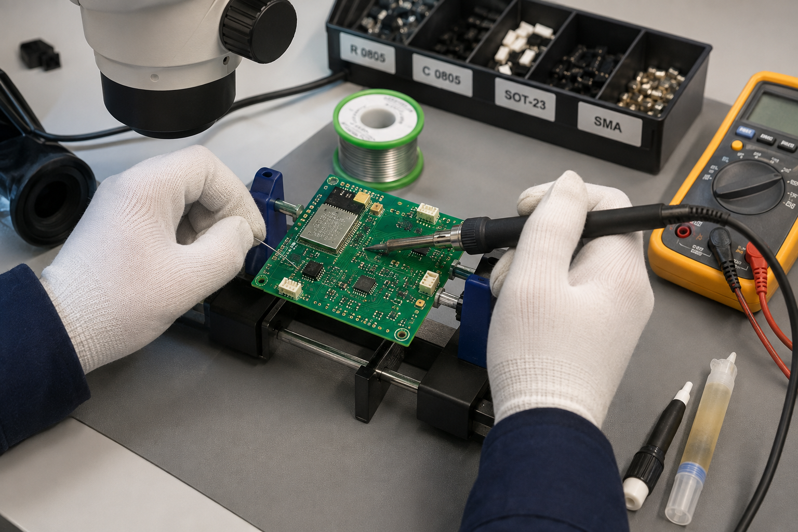

# SeaNergy soldering and rework notes

Document ID: HW-ASM-002  
Revision: A-preliminary  
Status: Process targets; populate actual lot, operator and measurements during build.

## 1. Workmanship controls

| Parameter | Target | Acceptance |
|---|---:|---|
| ESD mat and wrist strap | < 10^9 ohm path to protective earth | Tester indicates pass before unpacking semiconductors |
| Fine-pitch iron setpoint | 330 degC | +/-10 degC, calibrated tip |
| Through-hole iron setpoint | 350 degC | +/-10 degC |
| Maximum contact time | 3 s per joint | Allow 10 s cooling before rework |
| Lead-free paste | SAC305, Type 4 | Lot and expiry recorded |
| Reflow peak | 245 degC | 235-250 degC, <40 s above 217 degC |
| Ramp | 1.0-2.0 degC/s | No tombstoning or package cracking |
| Cleaning | Electronics-grade IPA | No flux residue under converter or high-impedance input |

## 2. Assembly order

1. Inspect bare PCB and verify all rail resistances.
2. Place 0402/0603 passives, resistor networks and ESD parts.
3. Place regulator, DAC, ADC, op-amp and logic ICs.
4. Reflow; inspect every fine-pitch package at 10x.
5. Hand-fit connectors, fuse, transformer and tall electrolytics.
6. Bring up power, MCU, converters, analog front end and driver in that order.
7. Fit sensors and the transducer only after electrical acceptance.

## 3. Fine-pitch and sensitive parts

- U3 ESP32-S3: keep the antenna keep-out free of copper, solder and enclosure metal.
- U4 MCP4921 and U6 OPA1652: fit local 100 nF decoupling before power; keep output nodes flux-free.
- RN1/RN2 R-2R networks: 0.1% matching is functional, not cosmetic. Do not substitute discrete 1% parts.
- INA226 shunt: Kelvin sense traces must land inside the shunt pads.
- TVS and reverse-polarity devices: verify orientation before any supply is applied.

## 4. Rework rules

- One controlled rework cycle is permitted without engineering review.
- Lifted pads, damaged solder mask, overheated op-amps and cracked MLCCs force a HOLD disposition.
- Never megger-test populated electronics or apply an insulation tester to sensor inputs.
- After DAC, op-amp or driver rework, repeat TP07-TP14 measurements and the dummy-load test.

## 5. Mechanical close-out

- AS568-246 NBR 70 O-ring: inspect, clean and apply a thin compatible silicone grease film.
- M3 A4-70 fasteners: tighten in a cross pattern, two passes, final target 0.50 N m.
- Cable penetrator torque remains the selected manufacturer's value; do not infer it from thread size.
- Record actual torque tool ID and calibration date in the assembly traveller.
