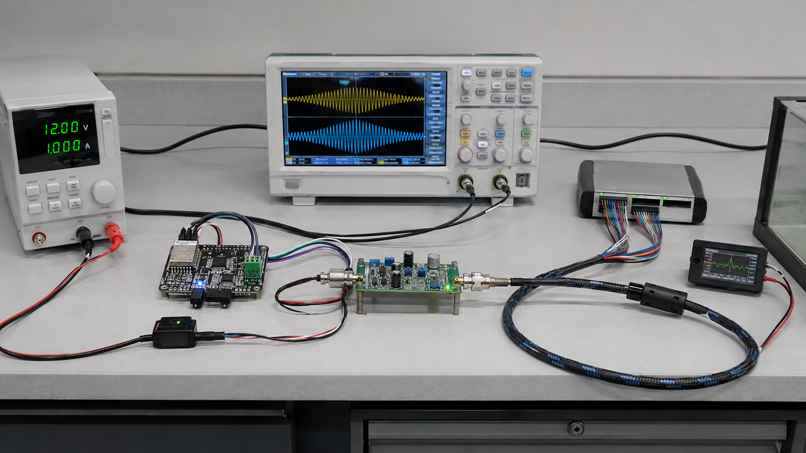

# SeaNergy bench setup

Document ID: HW-BENCH-001  
Status: Reproducible target setup; photographs and measured room noise remain open.

## 1. Rig definition

| Item | Specification | Control |
|---|---|---|
| DC supply | 0-15 V, >=3 A, programmable current limit | Begin each subsystem at its bring-up limit |
| Oscilloscope | >=50 MHz bandwidth, >=10 MSa/s, two channels | 20 MHz bandwidth limit for amplitude records |
| Differential probe | >=25 MHz, CAT rating suitable for bench supply | Mandatory across bridge/transformer nodes |
| Generator | 10 kHz-500 kHz sine and burst | 100 mVrms for filter sweep |
| DMM | 4.5 digit minimum | Rail tolerance and continuity |
| Power monitor | INA226 plus 10 mOhm, 1% shunt | >=2 kSa/s target during ping |
| Tank | 1500 x 600 x 600 mm internal | 500 mm fill depth; 450 L calculated volume |
| Target | 300 x 300 x 3 mm aluminium plate | 1.000 m +/-2 mm acoustic standoff |

## 2. Physical arrangement

1. Put the supply, controller and scope on a dry bench at least 500 mm from the tank edge.
2. Bond the tank frame to protective earth if metallic; keep signal ground isolated from the water.
3. Mount TX and RX at 250 mm depth, 300 mm from side walls and at least 200 mm above the bottom.
4. Align the plate normal to the acoustic axis using a square and laser line.
5. Route sensor and receive cables separately from bridge and transformer leads.

## 3. Reproducibility record

Required fields are test ID, tank dimensions, fill depth, water temperature, salt mass, kaolin mass, conductivity, NTU, transducer serial, standoff, instrument IDs, firmware hash and raw-data filename.

## 4. Current versus finished configuration

- Current bench: GU1008C-40T/R nominal 40 kHz pair, physical temperature/TDS/turbidity path and analog controls.
- Finished product: characterised PZT covering selected points in the modelled 148-351 kHz adaptation range, sealed penetrator, current sensing and calibrated pressure input.
- A 40 kHz tank echo is useful integration evidence but is not proof of the finished operating band.

## 5. Acceptance status

The rig design is complete. Labelled photographs, ambient noise-floor measurements and cross-lab reproduction are OPEN until the physical tank is assembled.
