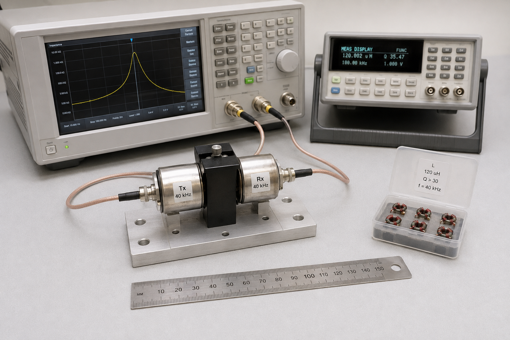

# Transducer characterisation

Document ID: HW-BENCH-004

## 1. Current bench element

Part: INGHAi GU1008C-40T/R separate transmitter/receiver.  
Supplier nominal frequency: 40 kHz.  
Supplier nominal clamped capacitance: 2100 pF +/-25% at 1 kHz.  
Status: part identified from DAA procurement evidence; impedance sweep not yet captured.

## 2. Matching-inductor starting value

For a first-order cancellation of clamped capacitance:

`L = 1 / ((2*pi*f)^2 * C)`

At f = 40,000 Hz and C = 2.10 nF, L = 7.54 mH. With the +/-25% capacitance range, the calculated starting range is 6.03-10.05 mH. This is a starting value only; motional resistance, cable capacitance and transformer leakage require tuning from measured impedance.

## 3. Measurement procedure

1. Measure open/short fixture compensation from 10-80 kHz.
2. Sweep magnitude and phase at <=1 Vrms in air, then repeat with the face submerged at the defined depth.
3. Record series resonance, parallel resonance, impedance at resonance, phase, clamped capacitance and -3 dB bandwidth.
4. Fit the nearest standard inductor, repeat, then tune in <=10% increments.
5. Keep drive energy low until ring-down and device temperature are stable.

## 4. Result register

| Parameter | Supplier / calculated | Measured result | Acceptance |
|---|---:|---:|---|
| Nominal frequency | 40 kHz | OPEN | 40 +/-1 kHz bench target |
| Clamped capacitance | 2.10 nF +/-25% | OPEN | Record at 1 kHz |
| Starting match inductance | 7.54 mH | OPEN | Tune from sweep |
| Ambient acoustic noise | Planning target <-70 dBVrms | OPEN | Record bandwidth and gain |

## 5. Finished-product transducer gate

The current 40 kHz element does not cover the modelled 148-351 kHz adaptation range. Select a characterised wideband element or a switched transducer bank only after vendor impedance, source-level, beamwidth, pressure rating and cable data are available. Enter the selected MPN in the BOM and repeat this complete procedure.
