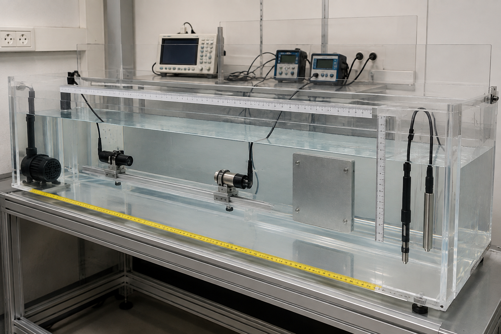

# Water-tank preparation and geometry

Document ID: HW-BENCH-002  
All recipe values below are starting estimates. Mass is controlled; conductivity and NTU are the accepted measured variables.

## 1. Tank and fill

Internal dimensions: 1500 x 600 x 600 mm.  
Fill depth: 500 mm.  
Calculated working volume: 1.500 x 0.600 x 0.500 = 0.450 m3 = 450 L.  
Volume acceptance: 450 L +/-5 L, confirmed from internal dimensions and fill depth.

## 2. Salinity recipes

Use non-iodised laboratory or food-grade sodium chloride. Dissolve in 20 L warm water, add to the tank, circulate for 20 minutes, then measure conductivity at the test temperature.

| Water case | Salt concentration | Salt mass for 450 L | Expected conductivity at 25 degC | Acceptance |
|---|---:|---:|---:|---|
| Fresh baseline | 0.000 g/L added | 0.000 kg | <1 mS/cm depending on source water | Record actual |
| Brackish | 15.000 g/L | 6.750 kg | 24 +/-2 mS/cm estimated | Use measured conductivity |
| Nominal seawater proxy | 35.000 g/L | 15.750 kg | 50 +/-3 mS/cm estimated | Use measured conductivity |

Conductivity values are planning estimates, not measurements. Temperature-compensate or report the uncompensated temperature.

## 3. Turbidity recipes

Dry kaolin at 105 degC for two hours, cool in a desiccator and weigh. Make a 10.000 g/L stock by dispersing 10.000 g in deionised water to 1.000 L. Agitate continuously. The starting conversion below uses 1 mg/L kaolin per NTU only to size material; the meter reading controls acceptance because particle grade and settling change the relationship.

| Target | Starting kaolin concentration | Kaolin mass equivalent in 450 L | 10 g/L stock addition | Measured acceptance |
|---:|---:|---:|---:|---|
| 5 NTU | 0.005 g/L | 2.25 g | 225 mL | 5 +/-1 NTU |
| 180 NTU | 0.180 g/L | 81.00 g | 8.10 L | 180 +/-9 NTU |
| 550 NTU | 0.550 g/L | 247.50 g | 24.75 L | 550 +/-28 NTU |
| 1000 NTU | 1.000 g/L | 450.00 g | 45.00 L | 1000 +/-50 NTU |

Replace removed water with stock so final volume remains 450 L. Record NTU at 0, 5, 15 and 30 minutes to quantify settling.

## 4. Target and transducer geometry

- Plate: 6061 aluminium, 300 x 300 x 3 mm, edges deburred.
- Plate normal angle: 0 deg +/-1 deg to the acoustic axis.
- TX-to-plate standoff: 1.000 m +/-2 mm.
- TX depth: 250 mm +/-5 mm.
- Bistatic RX offset when used: 100 mm +/-2 mm, same depth.
- Minimum wait after filling or mixing: 10 minutes after visible bulk flow stops.

## 5. Safety and disposal

Keep mains instruments outside the splash boundary, use RCD protection, and never energise an exposed bridge in water. Allow kaolin to settle and dispose of sludge under local laboratory rules; do not discharge concentrated solids directly to a drain.
