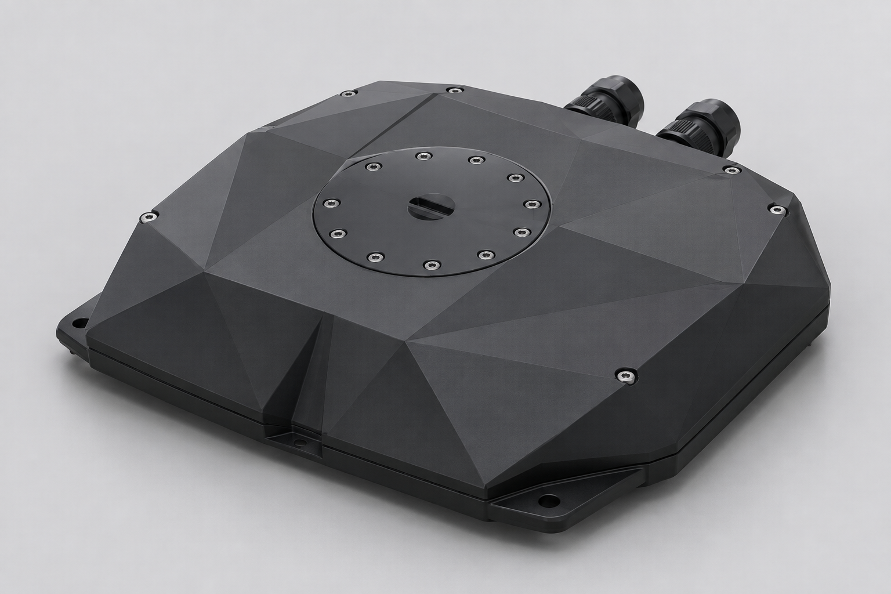
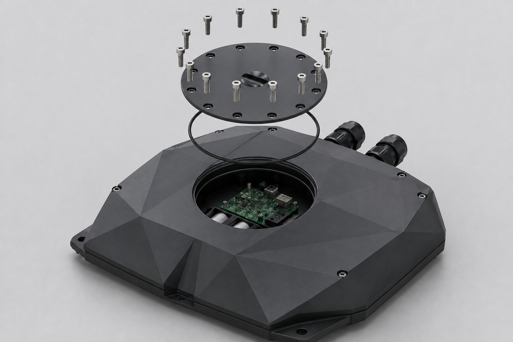

# CAD release status

- `hyper-grey-v1.stl` is the real DAA mesh: 168 x 210 x 40 mm, 3,934 facets.
- Mesh inspection found 49 edges whose incidence is not two, so it is not treated as a closed pressure solid.
- `seanergy-enclosure-v2.scad` is a parametric model for the maximum envelope, access cap, O-ring and fastener pattern.
- A STEP export is intentionally not supplied because FreeCAD/OpenSCAD is not installed and a false text file named `.step` would not be engineering evidence.
- Fabrication release requires a native solid CAD review and a verified STEP export.
