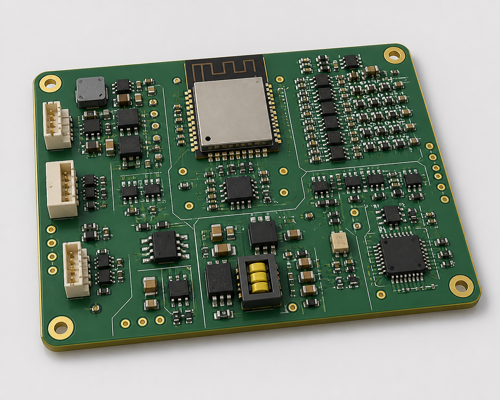
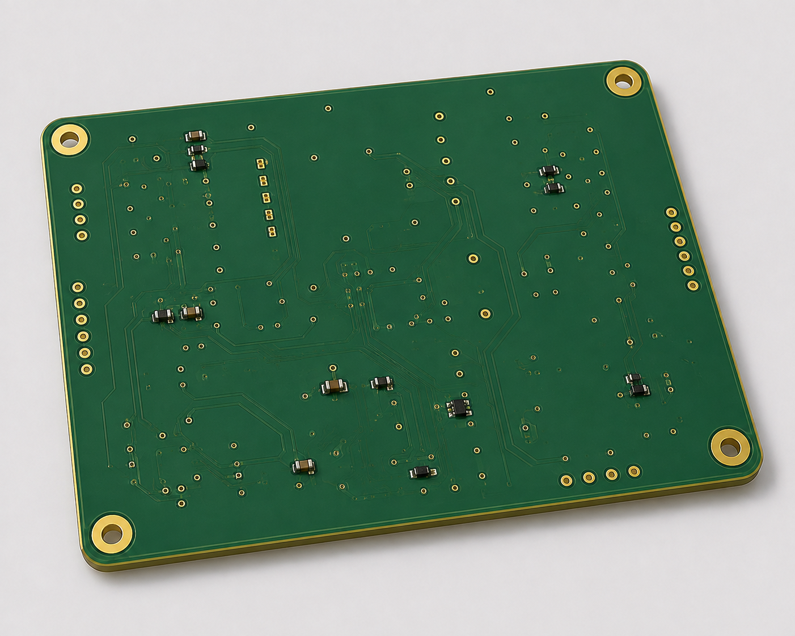
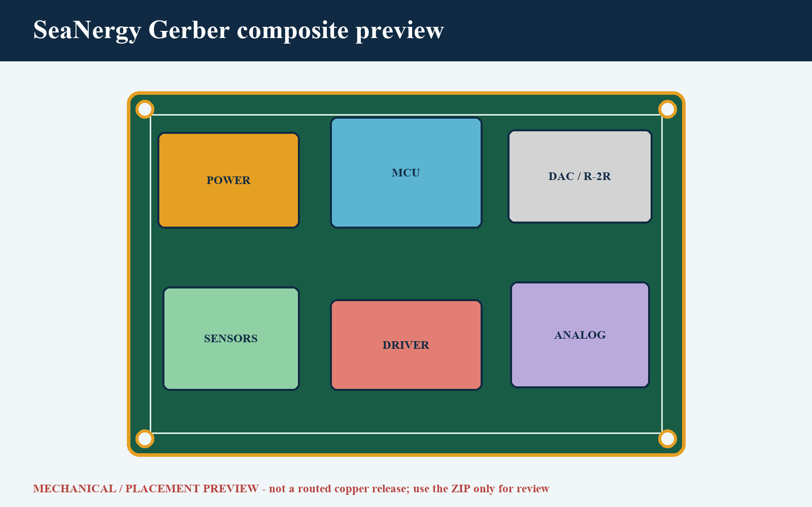
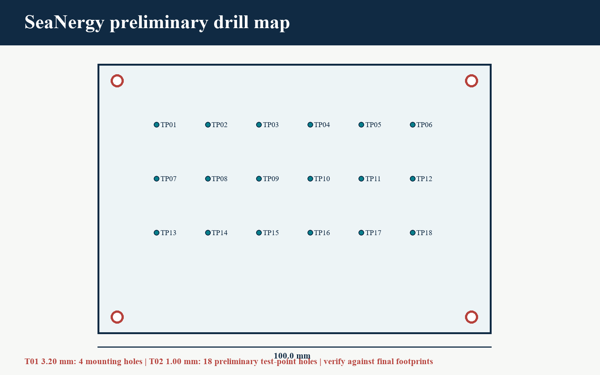

# SeaNergy PCB layout notes

The product views present the complete PCB assembly. The Gerber and drill graphics are derived from the stated 100 x 80 mm board data.

Document ID: HW-PCB-002  
Current state: architectural placement only. No DRC-clean or routed-board claim is made.

## 1. Partition and return paths

1. Power entry, fuse, TVS and buck occupy the northwest edge.
2. ESP32-S3 and USB occupy the north centre, with the antenna at the board edge and a full keep-out.
3. DAC, latch and R-2R network sit east of the MCU with the shortest practical clock/data path.
4. Reconstruction filter and receive amplifier sit southeast, separated from buck switch nodes by >=25 mm.
5. Driver, transformer and T/R limiter sit along the south edge beside the transducer connector.
6. Sensor connectors and quiet ADC occupy the southwest corner.

L2 remains a continuous ground plane. An AGND copper region on L1 serves DAC, reference and op-amp returns and joins DGND at one 0-ohm star adjacent to the DAC/reference return. No high-speed signal crosses a gap in its immediate reference plane.

## 2. R-2R and converter details

- RN1/RN2 are within 8 mm of U5; equal-length bit routes target <5 mm mismatch.
- Ladder return lands directly at AGND star, not at a sensor or driver return.
- MCP4921 is the safe bring-up path; the R-2R/latch path is a separately enabled high-throughput option.
- DAC outputs meet only through explicit 0-ohm population options; never populate both drivers onto one node.

## 3. Switching and protection

- Buck hot loop is kept under 150 mm2 and does not overlap analog nodes on adjacent layers.
- Reverse polarity, 2 A fuse and SMBJ15A TVS are first after the battery connector.
- T/R limiter is between the transformer/transducer node and receive amplifier.
- Driver bridge has paired gate/source routes and Kelvin current-shunt sensing.

## 4. Test points and silkscreen

TP01-TP18 match `assembly/test-points.md`. Each is accessible with the enclosure open. Silkscreen carries `SEANERGY REV A`, date `2026-09-07`, polarity, connector names and `SENSE -> MODEL -> DAC -> LPF -> DRIVER -> PZT` arrows.

## 5. Release gates

Placement review, footprint review, impedance stack confirmation, complete routing, DRC, ERC cross-check, 3D collision review, Gerber export and independent viewer inspection are OPEN.
