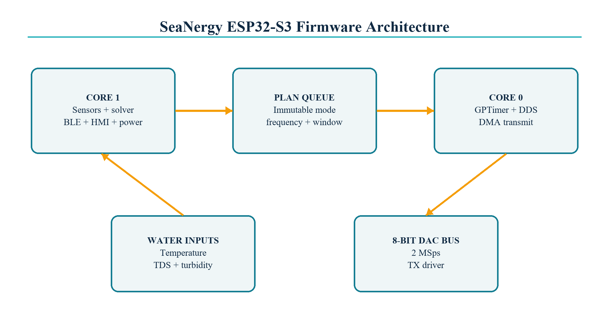

# Firmware architecture

## Runtime partition

| Task or ISR | Core | Priority | Stack | Period or trigger | Worst-case service budget |
|---|---:|---:|---:|---|---:|
| `tx` | 0 | 20 | 4,096 B | Queue + GPTimer | 2,098 us for 4,096 samples |
| LCD/i80 DMA ISR | 0 | hardware | IRAM | 1,024-byte completion | 8 us |
| GPTimer ISR | 0 | hardware | IRAM | One-shot | 4 us |
| `control` | 1 | 8 | 6,144 B | 20 ms | 1,000 us |
| NimBLE host | 1 | 5 | IDF-managed | BLE events | 2,000 us |
| `sensors` | 1 | 5 | 4,096 B | 1,000 ms | 820 ms including DS18B20 conversion |
| idle hook | 0 | idle | idle stack | Scheduler idle | 2 us |

Core 0 has one application owner: transmit. Sensor conversion, solver updates,
BLE processing, OLED refresh and power sampling remain on Core 1. The transmit
task blocks on the queue, hardware timer and DMA completion semaphores, allowing
the Core 0 idle hook to expose processor occupancy at GPIO 2.

## Data flow

1. ADS1115 and DS18B20 samples are scaled into integer engineering units.
2. The solver evaluates six acoustic candidates against range, water penalty,
   battery voltage and a 6.0 dB minimum margin.
3. A `solver_plan_t` is queued to Core 0.
4. GPTimer provides the start edge; DDS and envelope generation fill alternating
   1,024-byte internal-SRAM buffers.
5. LCD/i80 DMA clocks the 8-bit samples to the external DAC at 2 MSps.
6. INA226 integration and firmware status are encoded into a 48-byte BLE packet.

## GPIO allocation

| Function | GPIO | Reason |
|---|---|---|
| DS18B20 | 4 | Preserved from working prototype |
| Legacy I2S BCLK/WS/DATA | 5/6/7 | Preserved for bench A/B tests |
| I2C SDA/SCL | 8/9 | ADS1115, INA226 and OLED shared bus |
| Idle / envelope markers | 2/3 | Oscilloscope evidence |
| Pot rail / TX enable | 17/18 | Power gating and safe driver state |
| 8-bit DAC bus | 35-42 | Contiguous high GPIO bank |
| DAC WR / CS | 47/48 | LCD/i80 hardware strobes |
