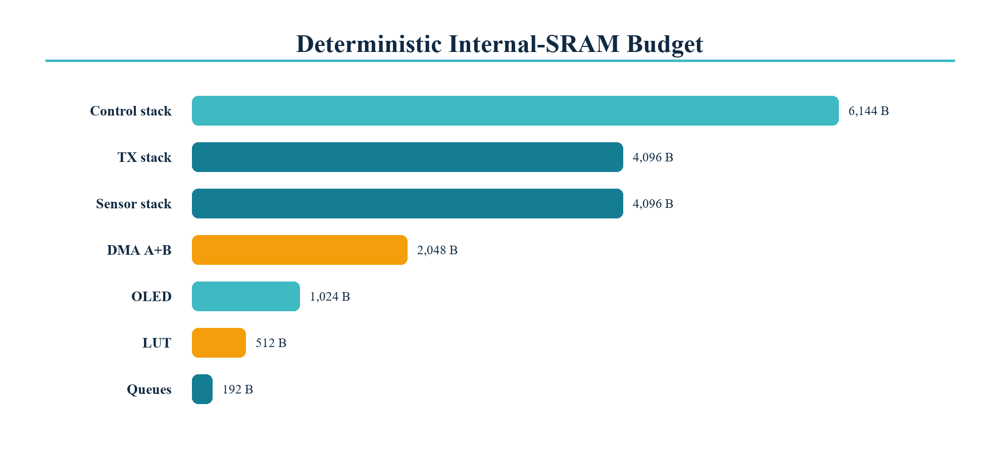

# Memory map and buffer budget

| Allocation | Region | Bytes | Lifetime | Capacity |
|---|---|---:|---|---|
| DMA waveform buffer A | Internal SRAM, DMA | 1,024 | Static | 512 us at 2 MSps |
| DMA waveform buffer B | Internal SRAM, DMA | 1,024 | Static | 512 us at 2 MSps |
| OLED framebuffer | Core 1 stack | 1,024 | 200 ms refresh | 128 x 64 x 1 bit |
| BLE telemetry packet | Core 1 stack | 48 | Notification | One complete packet |
| BLE command queue | Internal heap | 128 | Runtime | Eight 16-byte commands |
| Ping queue | Internal heap | 64 | Runtime | Two plans |
| TX task stack | Internal SRAM | 4,096 | Runtime | Core 0 |
| Sensor task stack | Internal SRAM | 4,096 | Runtime | Core 1 |
| Control task stack | Internal SRAM | 6,144 | Runtime | Core 1 |
| Sine lookup table | Flash/rodata | 512 | Static | 256 Q15 entries |
| Measurement storage | SPI flash | 1,982,464 | Persistent | SPIFFS partition |

The DMA buffers use `DMA_ATTR` and are never allocated from PSRAM. PSRAM is
available for non-real-time logging and future receive processing only. The
factory application partition is 1,966,080 bytes; coredump storage is 131,072
bytes.
