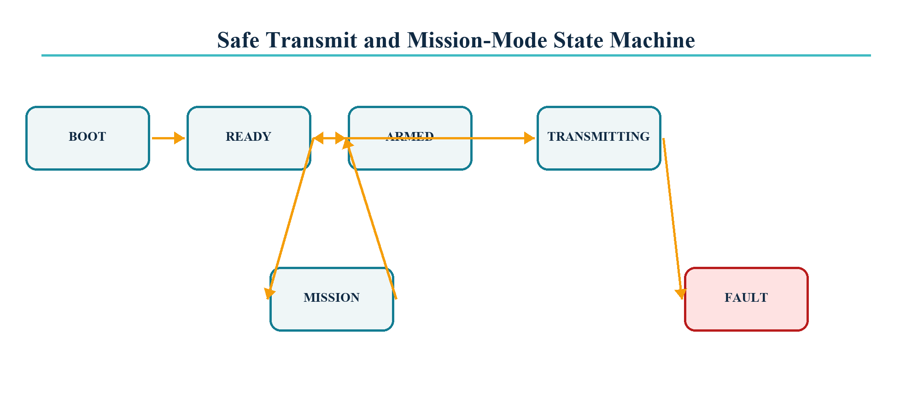

# Transmit state machine



| State | Entry condition | Hardware action | Exit condition |
|---|---|---|---|
| BOOT | Reset | Rails safe, DAC disabled | All required drivers initialised |
| READY | Boot complete or ping complete | TX disabled, BLE available | Valid trigger or command |
| ARMED | Ping queued | TX enable high, GPIO 3 high, timer armed | GPTimer alarm |
| TRANSMITTING | Timer alarm | i80 DMA streams all blocks | Final DMA completion |
| MISSION | Guarded command | BLE off, periodic autonomous solver/ping | Physical trigger |
| FAULT | DMA timeout or critical driver error | TX disabled immediately | Reset after fault inspection |

```text
BOOT -> READY -> ARMED -> TRANSMITTING -> READY
          |          |          |
          |          +----------+ failure -> FAULT
          +-- valid SNRG guard -> MISSION -> ARMED
MISSION -- physical trigger --> READY
```

Safety invariants:

- GPIO 18 is low in BOOT, READY and FAULT.
- No BLE opcode can enter mission mode without CRC and the `SNRG` guard word.
- The final DMA timeout path disables both the driver and envelope marker.
- The transmit task accepts complete immutable plans; solver state cannot change mid-ping.
