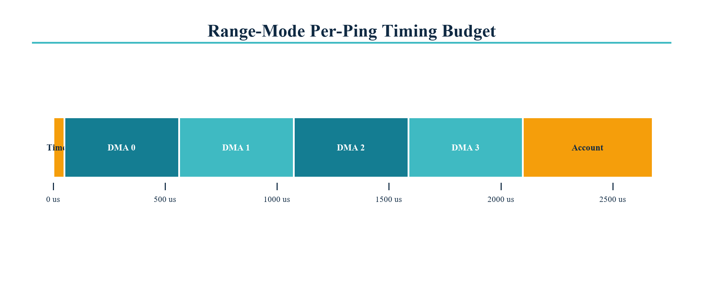

# Per-ping timing budget

All values below are engineering baselines for a 4,096-sample range ping at
2 MSps. GPIO 2 and GPIO 3 make the processor-idle and transmit-envelope values
directly measurable on the final board.

| Stage | Start | Duration | Executor | Limit |
|---|---:|---:|---|---:|
| Solver result already queued | -1,000 us | 1,000 us max | Core 1 | 100 ms |
| TX enable settles | 0 us | 50 us | Core 0 + GPTimer | 75 us |
| DMA block 0 | 50 us | 512 us | LCD/i80 DMA | 520 us |
| DMA block 1 | 562 us | 512 us | LCD/i80 DMA | 520 us |
| DMA block 2 | 1,074 us | 512 us | LCD/i80 DMA | 520 us |
| DMA block 3 | 1,586 us | 512 us | LCD/i80 DMA | 520 us |
| Driver disable | 2,098 us | 8 us | Core 0 | 15 us |
| INA226 read and packet encode | 2,106 us | 580 us | Core 1 | 1,000 us |

The sample period is 0.5 us. One 1,024-byte block therefore occupies 512 us.
Range, balanced and detail modes use 4,096, 3,072 and 2,048 samples,
corresponding to 2.048 ms, 1.536 ms and 1.024 ms envelopes.

## Latency instrumentation

- GPIO 3 rises immediately before the timer is armed and falls after the final DMA completion.
- GPIO 2 toggles on every Core 0 idle-hook pass.
- Adaptation latency starts at the final ADC read and ends when the new plan enters the TX queue.
- A two-channel scope capture must use the same timebase for GPIO 2 and GPIO 3.
