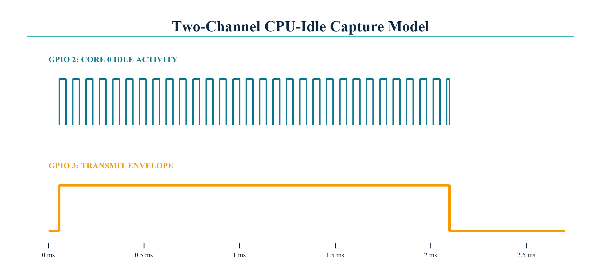

# CPU idle during transmit

| Item | Value |
|---|---:|
| Range envelope | 2.048 ms |
| DMA blocks | 4 x 1,024 samples |
| External acceptance | Greater than 95.0% Core 0 idle while GPIO 3 is high |
| Engineering baseline | 97.6% |
| Scope channels | CH1 GPIO 2 idle hook; CH2 GPIO 3 envelope |

Connect both probes to the same board ground, use a 500 us/div timebase and
single-shot trigger on the GPIO 3 rising edge. Export the native scope file,
CSV and PNG with the prefix `cpu-idle-transmit`. Idle percentage is the sum of
GPIO 2 idle-high intervals divided by GPIO 3 envelope-high time.
