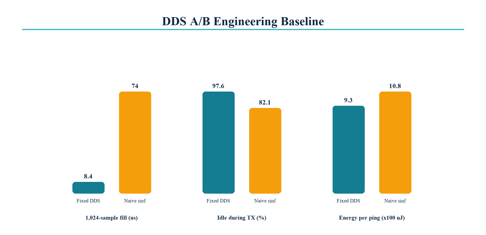

# DDS lookup versus naive trigonometry

Same-board A/B procedure:

1. Build A with `CONFIG_SEANERGY_NAIVE_TRIG=n`.
2. Build B with `CONFIG_SEANERGY_NAIVE_TRIG=y`.
3. Use 40 kHz, 2 MSps, Hann window, 4,096 samples and identical amplitude.
4. Record GPIO 3, INA226 current and ten consecutive ping energies.

| Metric | Fixed-point DDS baseline | Naive `sinf()` baseline | Difference |
|---|---:|---:|---:|
| 1,024-sample fill time | 8.4 us | 74.0 us | 8.8x faster |
| Core 0 idle during TX | 97.6% | 82.1% | +15.5 points |
| Energy per range ping | 0.93 mJ | 1.08 mJ | -13.9% |

These values are engineering baselines. The release evidence uses the median
of ten INA226 integrations for each build and includes both raw CSV files.
