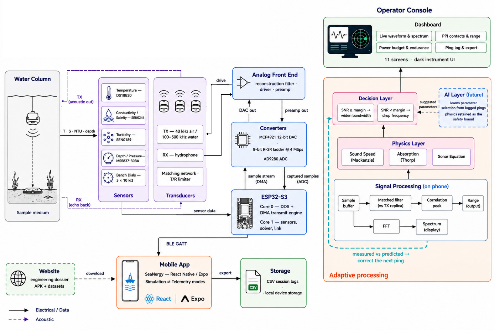
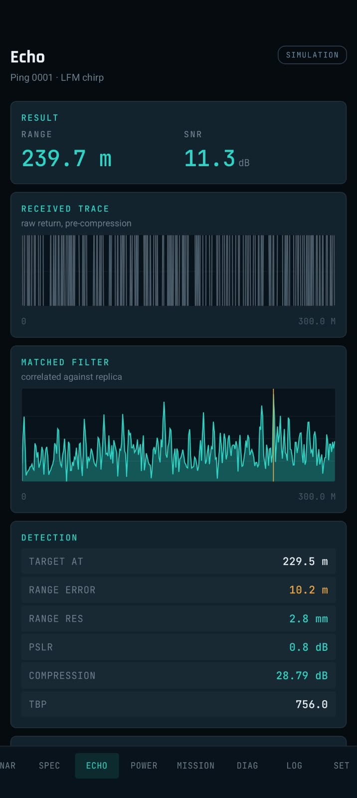
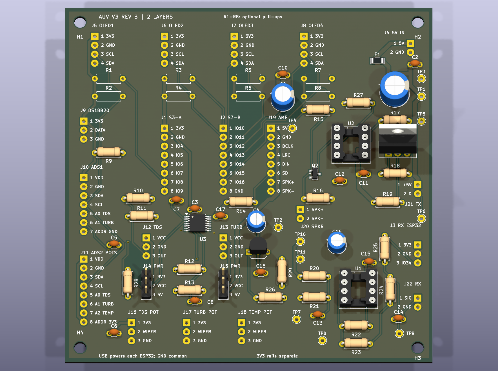

# SeaNergy

**Sonar that reads the water before it sends the ping.**

SeaNergy is Hyper Grey's Smart India Hackathon 2026 response to **Problem Statement 26058** from the Ministry of Earth Sciences / National Institute of Ocean Technology. It explores a low-power, software-defined sonar payload for autonomous underwater vehicles (AUVs): sense changing water conditions, choose a suitable acoustic pulse, transmit it, and inspect the return.

[Website](https://www.hypergrey.in/) · [Kaggle notebook](https://www.kaggle.com/code/prakhar1803/adaptive-sonar-waveform-selection) · [YouTube playlist](https://www.youtube.com/playlist?list=PLfZXQHCNRlPQ) · [Android APK](04-software/releases/SeaNergy-2.2.0___android.apk)

## The idea

A fixed sonar pulse has to trade range, detail, and energy against water that does not stay fixed. Temperature, salinity, turbidity, depth, and pH influence sound propagation and loss. SeaNergy combines an environmental model, a constrained waveform decision engine, transmit and receive electronics, and an offline operator console so each ping can be explained from its inputs through its waveform and echo.

*System architecture concept. The current Android app uses **five** environmental inputs and Francois–Garrison absorption; this earlier diagram omits pH, labels the older Thorp model, and shows 11 rather than 12 app screens. Its DAC/ADC chain and AI block are target architecture, not proof of an integrated flight payload.*

### From water to waveform to echo

| Layer | What SeaNergy does |
|---|---|
| **Sense and model** | Read or simulate temperature, salinity/TDS, turbidity, depth, and pH. Estimate sound speed, frequency-dependent absorption, and scattering for the selected mission. |
| **Choose and synthesize** | Score feasible pulse candidates against range, detection margin, resolution, and energy constraints. Generate a digital waveform with a selected centre frequency, bandwidth, duration, and envelope. |
| **Transmit and receive** | Drive a transmit transducer; capture the returning signal on a separate receive path. The Rev B bench board and the proposed higher-frequency payload use different electrical chains. |
| **Analyse and adapt** | Show the transmitted waveform and spectrum, correlate a return with the transmit replica, display detection and power estimates, and use echo feedback for the next decision in the modelled loop. |

## What is available now

| Part | Repository asset | Current state |
|---|---|---|
| **Operator app** | [Android source](04-software/mobile-android/) and [v2.2.0 APK](04-software/releases/SeaNergy-2.2.0___android.apk) | Built Android release. Offline simulation and payload telemetry modes. |
| **iOS app** | [iOS source](04-software/mobile-ios/) | Source and native project available; no installable IPA yet. |
| **Website** | [Live site](https://www.hypergrey.in/) and [static source](04-software/website/) | Deployed engineering dossier; local copy opens without a backend. |
| **Rev B electronics** | [KiCad design and manufacturing files](01-hardware/) | 100 × 100 mm, two-layer design with 91 component footprints. ERC/DRC and schematic-to-board checks pass; this board has **not been fabricated**. |
| **Firmware** | [ESP-IDF payload source](02-firmware/) and [Rev B bench sketch](01-hardware/kicad/firmware/ESP32-S3/) | Two distinct targets. The newer DDS/DMA flight path still needs its matching DAC and analog output hardware. |
| **Research and data** | [Generated dataset and notebook](05-models/) | Reproducible 20,000-row transmit-side dataset, modelling work, and evaluation artifacts. |
| **Validation** | [Test plan and dossier](06-validation/) | Procedures and engineering projections; physical tank and integrated acoustic results remain to be recorded. |

## Hardware and firmware

The **AUV V3 Compact Rev B** design puts an ESP32-S3 main/transmit controller and a separate ESP32 receiver on one PCB. It includes two ADS1115 converters, DS18B20 temperature sensing, TDS and turbidity inputs, OLED outputs, an audio path, and nominal 40 kHz transmit/receive elements. The board files include a bill of materials, wiring guide, Gerbers, checks, and a 3D render. [See the hardware documentation](01-hardware/README.md).

The firmware folder describes a different, higher-frequency payload path: a fixed-point direct digital synthesizer, selectable pulse envelopes, DMA sample transfer, sensor acquisition, and a constrained physics solver. Its parallel DAC and analog reconstruction/output stages are **not on the Rev B PCB**. The two configurations are documented separately so a PCB render, a source build, and a measured acoustic output are never confused. [See the firmware architecture](02-firmware/README.md).

## Operator app

The React Native / Expo console runs its physics and signal processing on the device. **Simulation mode** creates an end-to-end modelled mission offline. **Telemetry mode** reads the payload's reported environment and pulse over USB-C, Wi-Fi, or Bluetooth LE using a shared newline-delimited JSON format. The UI identifies the active mode so simulated results are not presented as live measurements.

Its 12 screens cover the console, sonar view, waveform and spectrum, echo and matched filter, environment, mission, power, link budget, diagnostics, logs, scenarios, and settings. Session data can be exported as local CSV. The Android APK is ready to install; the iOS source is present but needs a macOS/Xcode package build. [App details and build instructions](04-software/README.md).

| Echo analysis in **simulation** mode | Rev B PCB **design render** |
|:---:|:---:|
|  |  |

## Research, evidence, and project material

- **Adaptive waveform research:** [Kaggle notebook](https://www.kaggle.com/code/prakhar1803/adaptive-sonar-waveform-selection), [local model and dataset package](05-models/), and [research paper](07-documentation/research-paper/). The dataset is generated; it is not a collection of tank measurements.
- **Verification path:** [test procedures and validation dossier](06-validation/), [technical report](07-documentation/technical-report/), and [board verification record](01-hardware/verification-summary.md). Figures labelled as projections should not be cited as measured hardware performance.
- **Demonstration and presentation:** [YouTube playlist](https://www.youtube.com/playlist?list=PLfZXQHCNRlPQ) and [submission material](00-submission/). The playlist page exists, but no public video entries were visible when checked on **28 September 2026**.
- **Deployment and cost:** [business and cost analysis](09-business/) and the [live project site](https://www.hypergrey.in/).

## Explore the repository

| Folder | Start here |
|---|---|
| [00-submission/](00-submission/) | Pitch deck, compliance, and demo material |
| [01-hardware/](01-hardware/) | Electrical, PCB, enclosure, BOM, and bench setup |
| [02-firmware/](02-firmware/) | Embedded source, link contracts, and measurement methods |
| [03-research/](03-research/) | Literature and source material |
| [04-software/](04-software/) | Android and iOS console, website, and releases |
| [05-models/](05-models/) | Dataset, notebook, and model evaluation |
| [06-validation/](06-validation/) | Test plan and evidence dossier |
| [07-documentation/](07-documentation/) | Technical report, research paper, and guidance |
| [08-media/](08-media/) | Architecture, screenshots, and project media |
| [09-business/](09-business/) | Cost, market, roadmap, and IP material |
| [10-project/](10-project/) | Ownership, risks, and decisions |

**Team:** Hyper Grey, Maharaja Surajmal Institute of Technology. [Subsystem ownership and handoffs](10-project/team/ownership.md).
